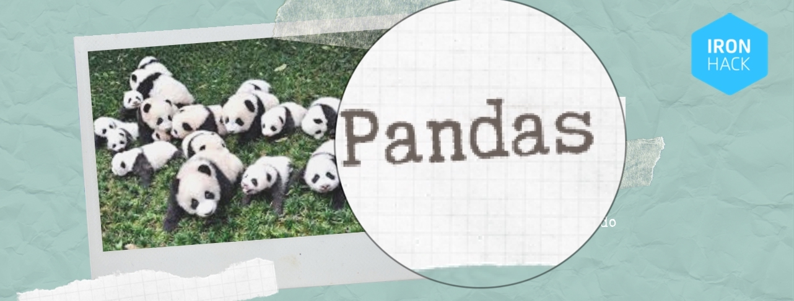
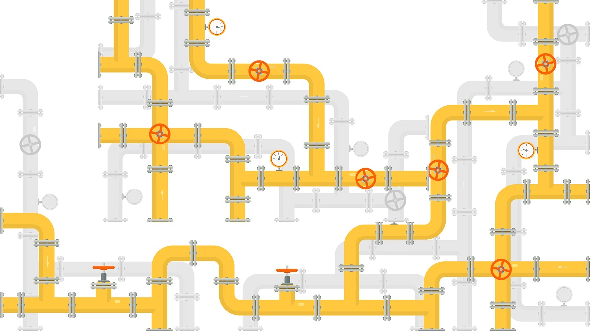
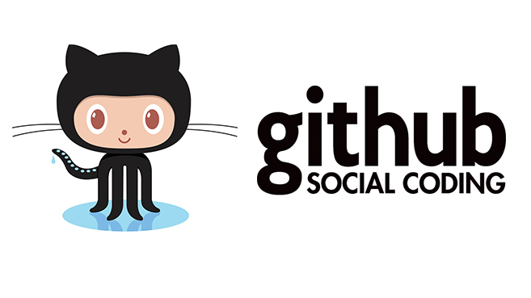

# Proyecto-1: Extract Transform Load (ETL)


El objetivo de este proyecto es combinar todo lo que has aprendido sobre la gestión, limpieza y manipulación de datos. Al final, tendras que hacer una presentacion que nos cautive. Así que arremangase y vende te como nunca!


# Desafio [Extracción]
---


Tendrás que demostrar tus habilidades obteniendo datos de distintas fuentes.

- Punto de partida: encuentra una fuente de datos iniciales. Si todavía no lo tienes no buen lugar para comenzar a buscar sería [Awesome Public Data Sets](https://github.com/awesomedata/awesome-public-datasets) y [Kaggle Data Sets](https://www.kaggle.com/datasets).

- Enriquece tus datos: alimenta tus datos extrayendo de otras fuentes de datos. Recuerda que tienes muchísima herramientas al alcance de tus manos para ello.
    - Llamadas a APIs.  
    Nota: La API que utilices puede requerir autenticación a través de token.

    - Web Scraping, que puede ser usando Selenium o BeautifulSoup. 
    
    Si quieres utilizar mas de una de estas herramientas, puedes. El limite es el cielo. **Pero al menos tienes que usar una.**

-  ¡Los datos que traigas para enriquecer el conjunto de datos inicial tendrán que estar relacionados con él y complementarlo! 


# Desafio [Exploratory Data Analysis (EDA)]
---



El Análisis Exploratorio de Datos o en inglés Exploratory Data Analysis (EDA) es un método de análisis de los conjuntos de datos para resumir sus principales características. Recuerda que implica el uso de gráficos y visualizaciones para explorar y analizar tu conjunto de datos. El objetivo es explorar, investigar y aprender, no confirmar hipótesis estadísticas.


A partir de todos los datos recolectados. Deberas importarlos, usar tus habilidades de gestión de datos para limpiarlos, analizarlos y luego exportarlos como un archivo de datos CSV limpio. 


## TO DO's
---

- Decide tus hipótesis o preguntas de investigación. Ten en cuenta que a lo largo del proyecto surgirán nuevas preguntas de gran valor. Pero cuidado con complicarte la vida; gestiona tu tiempo y focaliza tus esfuerzos en lo realmente importante. 

- Explora los datos y describe lo que has encontrado.
Puedes usar: `df.describe()`, `df["column"]`... etc.

- Usa al menos 5 técnicas de limpieza de datos dentro de un jupyter notebook. Recuerda analizar valores nulos, borrado de columnas, datos duplicados, manipulación de strings, aplicación de funciones, expresiones regulares, etc.

- Crea al menos cinco gráficos que sean perspicaces.

- Muestra datos que validen las conclusiones basadas en tus hipótesis en un jupyter notebook.

- Crea una narración convincente en torno a tus hallazgos. ¡Piensa en tus stakeholders y convence los con tus conclusiones! Recuerda que cualquiera puede acabar en tu repositorio; incluyendo los recruiters. (Algunas diapositivas con poco texto y tramas bonitas suelen ser útiles) 


## Sugerencias
---
- Examina los datos e intenta comprender qué significan los campos antes de sumergirte en los métodos de limpieza y manipulación de datos.


- Averigua cómo encajan y cómo preparar los datos de ambas fuentes para tu informe. Algunas sugerencias sobre cómo podrías lograr esto:

    - Tienes un conjunto de datos. Ahora puede usar una API usando los datos de una columna y crear una nueva con información valiosa de tu respuesta para cada fila.

    - Fusionar dos conjuntos de datos es complicado: necesitarías al menos la misma columna con los mismos datos en ambos. No pienses demasiado en esta etapa. Puedes establecer la relación de ambas fuentes de datos a través de una visualización.
    -  Crea algunos informes que contengan datos valiosos del conjunto de datos + enriquecimiento. 

    - Simplemente resume los datos y genera algunas estadísticas básicas ( mean, max, min, std, etc.).

    - Realiza estadísticas basadas en agregaciones de datos utilizando groupby().

    - Vuelve te loco con la investigación.

- Divide el proyecto en diferentes pasos: usa los temas cubiertos en las lecciones para formar una lista de tareas.

- Compromete te con el proyecto y se constante, no tengas miedo de hacer algo incorrectamente porque siempre podrás retroceder a una versión anterior. Los **commits** te ayudaran en esta tarea. 

- Consulta la documentación y los recursos proporcionados para comprender mejor las herramientas que estas utilizando.


# Desafio [Data Pipeline]
---


¿Qué es un pipeline?
Un pipeline de datos es una serie de procesos de datos en los que la salida de cada uno es la entrada del siguiente, formando una cadena.

Esto es super útil para cuando necesitemos una misma función en distintos proyectos para reutilizarlos. 

Para este apartado, deberas construir un pipeline de datos que procese los datos y produzca un resultado. Debes demostrar tus competencia con las herramientas que cubrimos en clase: funciones, clases, listas comprimidas, operaciones de strings, pandas y manejo de errores ... etc.


## TO DO's
---
Los requisitos técnicos para esta parte del proyecto son los siguientes:

- Debes construir una pipeline con la mayoría de tu código envuelto en funciones.

- Debes cubrir las siguientes etapas del pipeline de datos: adquisición de datos, limpieza, análisis e informes.

- Debes demostrar todos los temas que cubrimos hasta ahora (funciones, listas comprimidas, operaciones con strings, etc.) en tu procesamiento de datos.

- Deberá haber algún conjunto de datos que se importe y algún resultado que se exporte.

- Tu código debe guardarse en un archivo ejecutable de Python (.py) el cual deberá estar en una carpeta/directorio llamado `src`.


# Desafio [Carga en BBDD]
---


Para este desafío tendrás que generar una base de datos con los datos tratados de la extracción. 

Podrás hacerlo con MongoDB o con SQL. Eres libre de elegir la que quieras, pero por lo menos una de ellas deberá estar presente en tu proyecto. 

## TO DO's
---

- Si utilizas SQL 
    - Crear un modelo de datos con varias tablas y sus relaciones. 
    - ER Diagram (Esquema de relaciones entre tablas)
    - Adjuntar el código de creación del modelo de bbdd.
    - Generar un jupyter notebook con todo lo necesario para la carga de datos. 


# Desafio [Estructura de Repositorio]
---


En este apartado tendrás que crear un repositorio para tu proyecto. Ten en cuenta que estas compartiendo tu código de manera publica con toda la comunidad; gente como tú que quiere ampliar conocimientos pero también con recruiters. 

Es por eso que la estructura de un repositorio es esencial. Tienes que enganchar a tu lector. Tiene que ser accesible y esto empieza con un buen readme.


## .gitignore
---
Recuerda que hay cierta información sensible. Restringela con el `.gitignore`
    - Tokens
    - Datos protegidos por licencias o exigencias del propietario / creador de esa fuente de información. Lee bien la documentación por si las moscas


## README.md 
---

Aquí es donde presentas tu proyecto, donde tienes que venderte y cautivar al lector. Debes incluir la  motivación del proyecto en la introducción. Ademas tendrás que incluir las hipotesis inciales, los pasos que has seguido, tus conclusiones, las tecnologías usadas y las fuentes de las que has obtenido tus datos.  

## Estructuras de carpetas 
---
- data: aquí irán todos los datos del proyecto. Los inputs como los outputs. Recomendamos hacer sub carpetas dentro de data. 

- notebooks: aquí irán todos los jupyters utilizados dentro del proyecto. Recuerda que el nombrado deberá ser descriptivo de la tarea de su contenido. Ademas deberá estar numerados para su mejor entendimiento.

ejemplo :

```
1-extraccion_csv.ipynb
2-limpieza_csv.ipynb
3-llamada_API.ipynb
```

- src: aquí irán todos los ejecutables o archivos de soporte. 

ejemplo:
```
suport_extraction.py
clean.py
```
- images: imágenes de portada y/o gráficas.

- readme

# Cómo entregar el proyecto

- Crea un nuevo repositorio con el nombre `ETL_project` en tu github.
- Crea un archivo llamado README.md, este fichero debe estar en la raíz del repositorio con la documentación del proyecto. 

- Insistimos pero....Asegúrate de incluir tanta información útil como sea posible. Alguien que encuentre el README.md debería poder obtener una idea completa del proyecto sin navegar por sus archivos.

- Finalmente la entrega tendrás que hacerla via Issue con tu nombre en este repo. Donde tendrás que incluir el enlace a tu repo en comentarios. 


 **SIN BBDD SE CONSIDERA COMO PROYECTO NO ENTREGADO**
 
 **SIN API O WEB SCRAPING SE CONSIDERA COMO PROYECTO NO ENTREGADO**
 
 
 **SIN README SE CONSIDERA COMO PROYECTO NO ENTREGADO**


